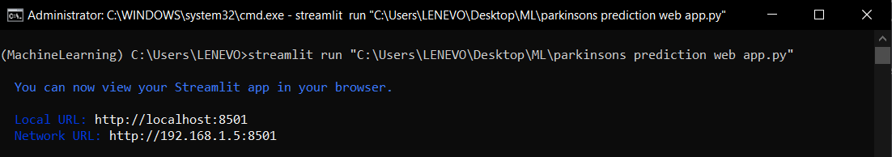
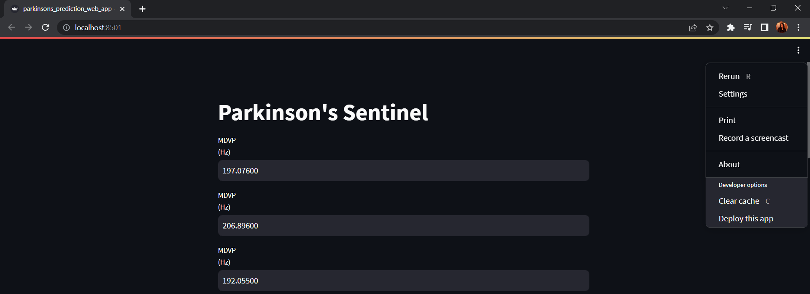
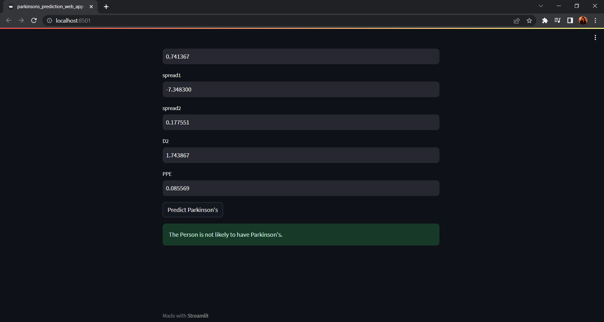

# Parkinson-s_Sentinel

This repository contains a machine-learning model for predicting Parkinson's disease using an SVM classifier and a Streamlit web app to interact with the model.
## Project Structure

- `model/`
  - `trained_model1.sav`: Trained SVM model for Parkinson's disease prediction
- `app/`
  - `parkinsons prediction web app.py`: Streamlit web app for interacting with the model
  - `requirements.txt`: List of dependencies required to run the app
## How to Use

- Load the SVM model using `joblib` or a similar library in Python.
- Run the Streamlit app locally using `streamlit run app/app.py`.

## Adding Input Values 

- Input the required parameters

- The WebApp displays the message after clicking the `Predict Parkinson's` button.

## Dependencies

To run the Streamlit app, you need the following dependencies:
- List of dependencies from `app/requirements.txt`
## Dataset Information

This dataset was picked up from kaggle and can be accessed here: <https://www.kaggle.com/datasets/gargmanas/parkinsonsdataset>
